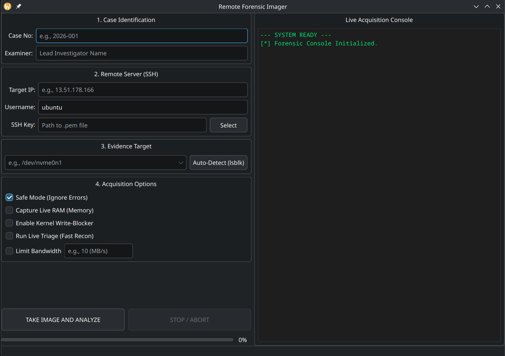
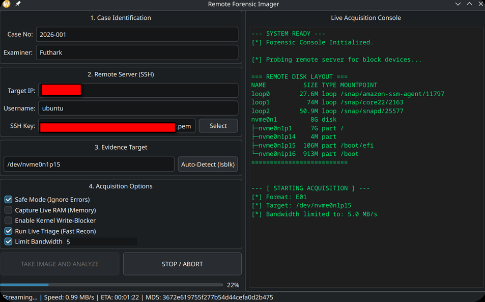

# 🕵️‍♂️ Remote Forensic Imager v2.1

**Remote Forensic Imager** is a professional, bit-stream acquisition tool designed for secure live disk and memory forensics from remote servers (AWS EC2, VPS, etc.) over encrypted SSH channels.

Developed by **Futhark1393**, this tool automates evidence collection while maintaining a strict **Chain of Custody (CoC)** and adhering to the **"Do No Harm"** forensic principle.



## 🚀 v2.1 Core Updates & Features

The v2.1 release introduces critical architectural refinements and operational features for high-stakes forensic environments:

* **Graceful Stop / Abort:** Securely terminate an ongoing acquisition without locking the UI or leaving zombie SSH connections.
* **Dynamic ETA & Progress Tracking:** Real-time calculation of remaining time, speed (MB/s), and total percentage based on exact remote block device sizes.
* **Network Resilience (Auto-Retry):** Automatically recovers from dropped SSH connections, resuming the `dd` bit-stream from the exact last successful chunk using `skip_bytes`.
* **Bandwidth Throttling:** Prevent network saturation during live forensics by limiting acquisition speed (e.g., 5 MB/s or 10 MB/s).
* **Live Triage (Fast Recon):** Automatically capture volatile system states (`uname -a`, `netstat`, `ps aux`) to `Triage_CaseNo.txt` right before physical imaging begins.
* **Safe Mode (Bad Sector Handling):** Bypasses physical disk errors on the target and pads unreadable sectors with zeros (`conv=noerror,sync`) to maintain hash integrity.
* **Native E01 (EnCase) Support:** Direct integration with `libewf` for physical bit-stream acquisition into compressed E01 format.
* **On-The-Fly Hashing:** Dual-Hash (SHA-256 and MD5) signatures are calculated synchronously in-memory.
* **Automated Reporting:** Generates detailed PDF and TXT Chain of Custody reports containing timestamps, examiner details, hashes, and triage statuses.



## 🔥 Proof of Concept: Data Carving & Bit-Stream Accuracy

To verify that the tool performs a true physical acquisition, a test was conducted on a 100MB AWS EC2 partition. The resulting image was analyzed using **Autopsy**, successfully carving historical artifacts from unallocated space.

**Carved Header Data:**


This artifact confirms that the Remote Forensic Imager successfully captures raw sector data, including data remanence and deleted files, proving its 100% lossless physical acquisition capability.

## 🏗️ Modular Architecture

* `codes/gui.py`: Manages the PyQt6 Material interface, input validation, and PDF/TXT reporting engine.
* `codes/threads.py`: The core `QThread` worker handling Paramiko SSH connections, throttling, auto-retry logic, and `pyewf` chunk-streaming.
* `forensic_qt6.ui`: The XML-based UI layout file.

## 🛠️ Environment & Installation

* **Tested OS:** Fedora Linux 43 (KDE Plasma), Ubuntu.
* **Language:** Python 3.10+
* **Dependencies:** `PyQt6`, `fpdf2`, `paramiko`, `qt-material`, `libewf`.

### ⚡ Automated Installation (Recommended)
The automated script installs all dependencies, compiles the `libewf` C-library, and sets up system-wide shortcuts (`rfi` command).

```bash
# 1. Clone the repository
git clone [https://github.com/Futhark1393/Remote-Forensic-Imager.git](https://github.com/Futhark1393/Remote-Forensic-Imager.git)
cd Remote-Forensic-Imager

# 2. Run the automated installer
chmod +x RFI_install.sh
./RFI_install.sh
```

### ⚙️ Manual / Advanced Installation
For forensic examiners who prefer to manually compile dependencies and audit the installation process:

```bash
# 1. Install system dependencies (Debian/Ubuntu)
sudo apt update
sudo apt install git autoconf automake libtool gcc python3-dev python3-pip -y

# For Fedora (User Environment)
sudo dnf install git autoconf automake libtool gcc python3-devel -y

# 2. Compile and install libewf with Python bindings
git clone [https://github.com/libyal/libewf.git](https://github.com/libyal/libewf.git)
cd libewf
./synclibs.sh
./autogen.sh
./configure --enable-python
make
sudo make install
sudo ldconfig
cd ..

# 3. Install Python packages
pip install PyQt6 fpdf2 paramiko qt-material
```

### 🚀 Usage
Once installed, launch the tool from your terminal or application menu:
* **Terminal:** Type `rfi` and hit Enter.
* **GUI:** Search for **"Remote Forensic Imager"** in your KDE/GNOME launcher.

## ⚠️ Disclaimer & Legal Warning
This tool is for educational purposes, incident response, and authorized forensic investigations. The author (**Futhark1393**) is not responsible for any misuse or legal consequences. Always ensure you have explicit, written permission from the system owner.

---
**Developed by Futhark1393**
