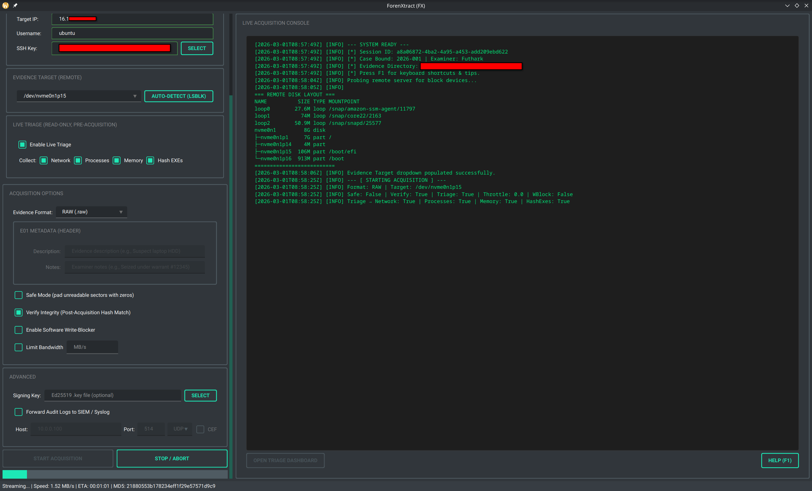
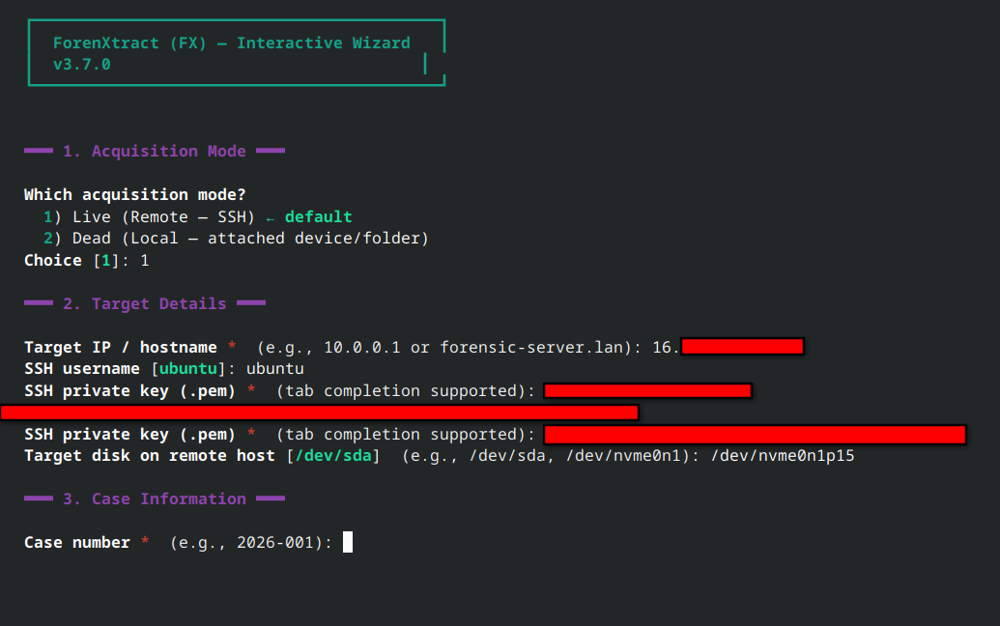
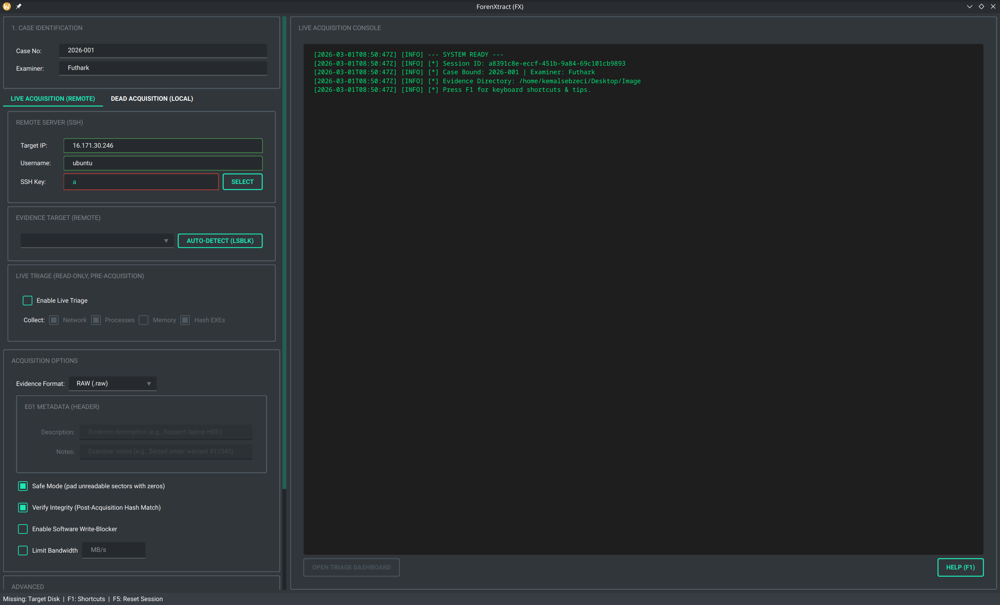

# ForenXtract (FX)

**Author:** Kemal Sebzeci · **Version:** 3.8.0 · **License:** Apache-2.0

ForenXtract (FX) is a **case-first forensic disk acquisition framework** built with **Python + PyQt6**. It supports both **Live (Remote/SSH)** and **Dead (Local)** acquisition through a tabbed GUI and a fully headless CLI.

**Key differentiators:**
- Explicit **session state machine** enforcing forensic workflow ordering
- **Tamper-evident JSONL audit trail** with cryptographic hash chaining + optional Ed25519 signing
- **Interactive CLI wizard** (`fx-acquire -i`) — step-by-step guided acquisition, no flags to memorize
- **DDSecure-style bad sector error map** — granular offset list of unreadable sectors (text log + JSON + ddrescue mapfile)
- **Real-time input validation** in GUI with visual feedback
- Four output formats: **RAW**, **RAW+LZ4**, **E01**, **AFF4**
- Live triage (network, processes, memory) with **interactive HTML dashboard**
- TXT + PDF forensic reports generated automatically

---

## Table of Contents

- [Installation](#installation)
- [Quick Start](#quick-start)
- [GUI Overview](#gui-overview)
- [CLI Reference](#cli-reference)
- [Core Capabilities](#core-capabilities)
- [Evidence Formats](#evidence-formats)
- [Bad Sector Error Map](#bad-sector-error-map)
- [Live Triage & Dashboard](#live-triage--dashboard)
- [Architecture](#architecture)
- [Output Artifacts](#output-artifacts)
- [Testing](#testing)
- [License](#license)

---

# Installation

## Quick Install (Recommended)

~~~bash
git clone https://github.com/Futhark1393/ForenXtract.git
cd ForenXtract
sudo bash FX_install.sh
~~~

The installer:
- Detects your distro (Fedora/RHEL or Debian/Ubuntu/Kali) and installs system dependencies
- Downloads and compiles **libewf** (E01 format support)
- Creates a Python virtual environment (`.venv/`)
- Installs the FX package inside the venv
- Symlinks `fx`, `fx-acquire`, `fx-verify` → `/usr/local/bin`
- Creates an application menu shortcut

| Flag | Effect |
|------|--------|
| *(none)* | Full install with E01 support |
| `--no-ewf` | Skip libewf compilation (faster, RAW only) |
| `--with-aff4` | Also install `pyaff4` for AFF4 format support |
| `--with-lz4` | Also install `lz4` for compression support |

~~~bash
sudo bash FX_install.sh --no-ewf        # fast install, RAW only
sudo bash FX_install.sh --with-aff4     # full install + AFF4
~~~

After install, open a **new terminal** and run:

~~~bash
fx                  # Launch GUI
fx-acquire -i       # Interactive CLI wizard
fx-verify --help    # Audit chain verification
~~~

<b>Manual Install</b> (click to expand)

### 1) Clone

~~~bash
git clone https://github.com/Futhark1393/ForenXtract.git
cd ForenXtract
~~~

### 2) System Dependencies

**Ubuntu / Debian / Kali**
~~~bash
sudo apt update && sudo apt install -y \
  libegl1 libgl1 libglib2.0-0 libxkbcommon0 libxkbcommon-x11-0 \
  libxcb1 libxcb-icccm4 libxcb-image0 libxcb-keysyms1 libxcb-randr0 \
  libxcb-render0 libxcb-render-util0 libxcb-shape0 libxcb-shm0 libxcb-sync1 \
  libxcb-xfixes0 libxcb-xinerama0 libxcb-xkb1 libxrender1 libxi6 \
  libsm6 libice6 libfontconfig1 libfreetype6
~~~

**Fedora**
~~~bash
sudo dnf install -y qt6-qtbase qt6-qtbase-gui mesa-libEGL mesa-libGL
~~~

### 3) Python Virtual Environment

~~~bash
python3 -m venv .venv
source .venv/bin/activate
pip install -U pip
pip install -e .
~~~

### 4) Optional: E01 Support

~~~bash
sudo apt install -y libewf2 python3-libewf   # Debian/Ubuntu/Kali
# or
pip install libewf-python
~~~

### 5) Optional: AFF4 Support

~~~bash
pip install pyaff4
# or
pip install -e ".[aff4]"
~~~

---

# Quick Start

## GUI — Three Clicks to Acquire

~~~bash
fx
~~~

1. **Case Wizard** opens → enter case number, examiner name, evidence directory
2. Fill in target details (IP/SSH for live, device/folder for dead)
3. Click **START ACQUISITION**

Input fields validate in real-time (green = valid, red = invalid). The status bar always shows what's missing.

## CLI — Interactive Wizard

~~~bash
fx-acquire -i
~~~

The wizard walks you through every parameter step by step — no flags needed:

~~~
  ┌──────────────────────────────────────────┐
  │  ForenXtract (FX) — Interactive Wizard   │
  └──────────────────────────────────────────┘

  ━━━ 1. Acquisition Mode ━━━
  Which acquisition mode?
    1) Live (Remote — SSH)     ← default
    2) Dead (Local — attached device/folder)
  Choice [1]: 

  ━━━ 2. Target Details ━━━
  Target IP / hostname: 10.0.0.5
  SSH username [ubuntu]: 
  SSH private key (.pem): ~/.ssh/key.pem    ← tab completion works
  Target disk on remote host [/dev/sda]: 
  ...
~~~

At the end, FX shows a summary and prints the **equivalent CLI command** for scripting/reproducibility.

## CLI — Direct Flags (Scripting / Automation)

~~~bash
# Live acquisition
fx-acquire \
  --ip 10.0.0.1 --user ubuntu --key ~/.ssh/key.pem \
  --disk /dev/sda --output-dir ./evidence \
  --case 2026-001 --examiner "Investigator" \
  --format RAW --verify

# Dead acquisition (block device)
fx-acquire --dead \
  --source /dev/sdb --output-dir ./evidence \
  --case 2026-001 --examiner "Investigator" \
  --format E01 --verify --write-blocker \
  --description "Suspect laptop HDD" --notes "Warrant #12345"

# Dead acquisition (directory / logical)
fx-acquire --dead \
  --source /mnt/usb/evidence_folder/ --output-dir ./evidence \
  --case 2026-001 --examiner "Investigator"
~~~

---

# GUI Overview

## Workflow

| Step | Screen | Description |
|------|--------|-------------|
| 1 | Case Wizard | Enter case number, examiner, evidence directory |
| 2 | Main Interface | Configure target, options, format — fields validate in real-time |
| 3 | Acquisition | Progress bar, speed, ETA, live console output |
| 4 | Results | Hash verification, audit trail sealed, reports generated |

### Screens

| Case Wizard | Main Interface |
|:-----------:|:--------------:|
|  |  |

| Acquisition Running | Verification Progress |
|:-------------------:|:---------------------:|
|  |  |

| Dead Acquisition Tab | Disk Discovery |
|:--------------------:|:--------------:|
|  |  |

## Real-time Validation

Input fields change border color as you type:
- 🟢 **Green border** — valid input
- 🔴 **Red border** — invalid input
- Status bar shows which fields are still missing

## Keyboard Shortcuts

| Shortcut | Action |
|----------|--------|
| **F1** | Help — show shortcuts & tips dialog |
| **F5** | Reset session for new acquisition |
| **Ctrl+Q** | Quit application |

---

# CLI Reference

## `fx-acquire` — Forensic Acquisition

### Interactive Mode (Recommended for First-Time Use)

~~~bash
fx-acquire -i               # or --interactive
~~~

Walks through all parameters interactively with defaults, validation, and tab completion.

### Mode Selection

| Parameter | Description |
|-----------|-------------|
| `-i`, `--interactive` | **Interactive step-by-step wizard** (no other flags needed) |
| *(default)* | Live mode — remote acquisition via SSH |
| `--dead` | Dead mode — local block-device or directory acquisition |
| `--source PATH` | Source device or directory for dead mode |

### Live Mode Parameters

| Parameter | Description |
|-----------|-------------|
| `--ip` | Target IP / hostname |
| `--user` | SSH username |
| `--key` | Path to SSH private key (.pem) |
| `--disk` | Target block device on remote host |

### Shared Parameters

| Parameter | Description |
|-----------|-------------|
| `--output-dir` | Evidence output directory |
| `--case` | Case number |
| `--examiner` | Examiner name |
| `--format` | `RAW` / `RAW+LZ4` / `E01` / `AFF4` (default: RAW) |
| `--verify` | Post-acquisition SHA-256 verification |
| `--safe-mode` | Pad unreadable sectors with zeros (default: on) |
| `--write-blocker` | Software write-blocker |
| `--throttle N` | Bandwidth limit in MB/s |
| `--signing-key PATH` | Ed25519 key for audit trail signing |
| `--description TEXT` | E01 header: evidence description |
| `--notes TEXT` | E01 header: examiner notes |

### Triage Parameters (Live Mode Only)

| Parameter | Description |
|-----------|-------------|
| `--triage` | Enable live triage before acquisition |
| `--no-triage-network` | Skip network state collection |
| `--no-triage-processes` | Skip process list collection |
| `--triage-memory` | Collect memory metadata |
| `--no-hash-exes` | Skip per-process SHA-256 exe hashing |

### SIEM / Syslog Parameters

| Parameter | Description |
|-----------|-------------|
| `--siem-host HOST` | Syslog/SIEM server |
| `--siem-port PORT` | Syslog port (default: 514) |
| `--siem-protocol` | `UDP` / `TCP` (default: UDP) |
| `--siem-cef` | CEF output instead of RFC 5424 |

### Examples

~~~bash
# Live acquisition with triage + SIEM forwarding
fx-acquire \
  --ip 10.0.0.1 --user ubuntu --key ~/.ssh/key.pem \
  --disk /dev/sda --output-dir ./evidence \
  --case 2026-001 --examiner "Investigator" \
  --triage --triage-memory \
  --siem-host 10.0.0.100 --siem-protocol TCP

# Dead acquisition with LZ4 compression
fx-acquire --dead \
  --source /dev/sdb --output-dir ./evidence \
  --case 2026-001 --examiner "Investigator" \
  --format RAW+LZ4 --verify --write-blocker
~~~

## `fx-verify` — Audit Chain Verification

~~~bash
fx-verify AuditTrail_CASE_SESSION.jsonl                      # chain only
fx-verify AuditTrail_CASE_SESSION.jsonl --pubkey fx_signing.pub  # + signature
fx-verify AuditTrail_CASE_SESSION.jsonl --json               # machine-readable
fx-verify AuditTrail_CASE_SESSION.jsonl --quiet              # PASS/FAIL only
~~~

Exit codes: `0` = PASS · `2` = FAIL (tamper detected) · `1` = Error

---

# Core Capabilities

## Session State Machine

~~~text
NEW → CONTEXT_BOUND → ACQUIRING → VERIFYING → SEALED → DONE
                         ↑    ↓
                         └ abort()
~~~

- Illegal transitions raise `SessionStateError` and halt operation
- `abort()` returns to `CONTEXT_BOUND` after stop/error (allows retry)
- `reset()` (F5 in GUI) returns to `NEW` for a fresh workflow

## Tamper-Evident Audit Logging

- **JSONL** format with cryptographic chaining (`prev_hash → entry_hash`)
- Per-session genesis block with `session_id` + `os.urandom` entropy
- Forced disk flush (`fsync`) per record
- Optional **Ed25519 digital signature** (passphrase-encrypted private keys)
- Optional **SIEM/Syslog forwarding** (RFC 5424 UDP/TCP, CEF mode)
- Sealed with `chmod 444` + optional `chattr +i` (immutable)

## Acquisition & Integrity

- SSH-based remote acquisition (live) or direct block-device / directory reading (dead)
- **DDSecure-style bad sector error map** — granular retry (4 MB → 64 KB → 4 KB → 512 B) to pinpoint exact unreadable offsets; exports as text log, JSON, and ddrescue-compatible mapfile
- **Real-time bad sector counter** in CLI progress bar (`BAD:N` indicator)
- **Output re-verification** — written image SHA-256 compared to stream hash (FTK Imager-style)
- On-the-fly dual hashing (MD5 + SHA-256)
- Safe Mode (`conv=noerror,sync`), software write-blocker, throttling
- **E01 metadata headers** — case, examiner, description, notes embedded via `set_header_value()`
- **Privilege elevation** — `pkexec` for block-device access (no password in terminal)
- Graceful stop: Ctrl+C in CLI seals audit trail; Stop button in GUI force-closes SSH
- Automatic retry on connection loss (up to 3 retries with resume)

---

# Evidence Formats

| Format | Extension | Pros | Cons | Requirements |
|--------|-----------|------|------|--------------|
| **RAW** | `.raw` | Fast, universal | Uncompressed (large) | *(none)* |
| **RAW+LZ4** | `.raw.lz4` | Fast compression (~50% ratio) | Needs `lz4` to decompress | `lz4>=4.0.0` |
| **E01** | `.E01` | EnCase/Autopsy/FTK compatible | Slower, needs libewf | `libewf2` + `pyewf` |
| **AFF4** | `.aff4` | Open standard, flexible | Less adoption | `pyaff4` |

Hash is computed on **raw disk data before compression**, ensuring evidence integrity regardless of container format.

> [!WARNING]
> **Safe Mode ↔ Verification Incompatibility**
>
> Safe Mode pads unreadable sectors with zeros, changing the image hash.
> Source hash will **never** match if Safe Mode encountered bad sectors.
>
> **FX detects this conflict** — both GUI and interactive CLI wizard warn you and offer to disable one.

---

# Bad Sector Error Map

When Safe Mode is enabled, FX handles unreadable sectors with a **DDSecure-style granular retry** strategy:

1. A 4 MB chunk fails to read
2. FX retries with **512-byte blocks** to pinpoint the exact bad offsets
3. Each sub-block gets up to 3 retry attempts before being zero-padded
4. Every unreadable region is recorded with its exact byte offset and length

### Export Formats

| Format | File | Description |
|--------|------|-------------|
| **Text Log** | `*.bad_sectors.log` | Human-readable DDSecure-style offset table |
| **JSON** | `*.bad_sectors.json` | Machine-readable with full metadata |
| **ddrescue Map** | `*.bad_sectors.mapfile` | GNU ddrescue-compatible mapfile |

### Text Log Example (DDSecure-style)

~~~text
# ForenXtract — Bad Sector Error Map (DDSecure-style)
# Source    : /dev/sda
# Total bad regions  : 4
# Total bad bytes    : 7,680
# Total bad sectors  : 15 (512-byte)

OFFSET (hex)          OFFSET (dec)        END OFFSET (hex)      LENGTH        SECTORS(512)  RETRIES   ERROR
----------------------------------------------------------------------------------------------------------------------------------
0x0000000000000000    0                   0x0000000000000200    512           1             3         Input/output error
0x0000000004000000    67108864            0x0000000004001000    4096          8             3         EIO: I/O error
0x0000000008001000    134221824           0x0000000008001400    1024          2             2         Input/output error
0x0000000010000000    268435456           0x0000000010000800    2048          4             1         Read fault
~~~

### CLI Progress

Bad sectors are visible **in real-time** during acquisition:

~~~text
  [██████████████░░░░░░░░░░░░░░░░]  45% | 500 MB | 120.5 MB/s | ETA: 00:15:32 | BAD:3
~~~

After acquisition completes:

~~~text
  ⚠ BAD SECTORS DETECTED
  Bad Regions  : 4
  Bad Bytes    : 7,680
  Summary      : 4 bad region(s) — 7,680 bytes (15 sector(s) @ 512B) unreadable, zero-padded in output image.
  Error Map Files:
    Text Log   : /evidence/evidence_2026-001_20260301.raw.bad_sectors.log
    JSON Map   : /evidence/evidence_2026-001_20260301.raw.bad_sectors.json
    ddrescue   : /evidence/evidence_2026-001_20260301.raw.bad_sectors.mapfile
~~~

The ddrescue mapfile can be fed directly into GNU ddrescue for targeted re-imaging of only the bad regions.

---

## Signing Keypair

~~~bash
# Without passphrase
python -c "from fx.audit.signing import generate_signing_keypair; generate_signing_keypair('.')"

# With passphrase (recommended)
python -c "from fx.audit.signing import generate_signing_keypair; generate_signing_keypair('.', passphrase='my-secret')"
~~~

---

# Live Triage & Dashboard

Volatile evidence collected **before** acquisition. All operations are strictly **read-only**.

| Module | Collects | Output |
|--------|----------|--------|
| Network | `ss`, ARP, routing, DNS | `NetworkState_<CASE>_<UTC>.txt` + `.json` |
| Processes | `ps aux` + per-exe SHA-256 | `ProcessList_<CASE>_<UTC>.txt` + `.json` |
| Memory | `/proc/meminfo`, modules | `MemoryState_<CASE>_<UTC>.json` |

Every triage artifact is SHA-256 hashed and recorded in the audit trail.

## Interactive Dashboard

If triage is enabled, FX generates an **interactive HTML dashboard** with Plotly visualizations:

| Chart | Description |
|-------|-------------|
| Top CPU/Memory Consumers | Bar charts of resource usage |
| Process Distribution | Pie chart by user |
| Network Connection States | ESTABLISHED, LISTEN, TIME_WAIT, etc. |
| Protocol Distribution | TCP vs UDP |
| Memory Usage Gauge | Real-time RAM utilization |

- Fully offline (Plotly.js bundled inline — works in air-gapped labs)
- Responsive design with interactive charts (zoom, pan, hover)
- After acquisition, click **Open Triage Dashboard** in GUI or open the HTML file directly

---

# Architecture

~~~text
fx/
├── cli/                        # Headless CLI tools
│   ├── acquire.py              # fx-acquire (live + dead, SIGINT handler)
│   ├── verify.py               # fx-verify (chain + signature verification)
│   └── interactive.py          # Interactive step-by-step wizard
├── triage/                     # Live triage collectors (read-only)
│   ├── orchestrator.py         # Triage coordinator + artifact hashing
│   ├── network.py
│   ├── processes.py
│   └── memory.py
├── ui/                         # Qt / GUI layer
│   ├── gui.py                  # CaseWizard + ForensicApp (real-time validation)
│   ├── workers.py              # AcquisitionWorker + DeadAcquisitionWorker
│   └── resources/forensic_qt6.ui
├── core/                       # Business logic (Qt-free, headless-testable)
│   ├── session.py              # Workflow state machine (NEW → DONE)
│   ├── hashing.py              # StreamHasher (MD5 + SHA-256)
│   ├── policy.py               # Write-blocker, dd builder
│   ├── validation.py           # Shared validators (IP, SIEM, signing key)
│   └── acquisition/
│       ├── base.py             # AcquisitionEngine + evidence writer factory
│       ├── dead.py             # DeadAcquisitionEngine (granular bad sector retry, re-verify)
│       ├── bad_sector_map.py   # DDSecure-style error map (text log + JSON + ddrescue mapfile)
│       ├── raw.py              # RawWriter (with fsync)
│       ├── ewf.py              # EwfWriter (with E01 metadata)
│       ├── lz4_writer.py       # LZ4Writer
│       ├── aff4.py             # AFF4Writer
│       └── verify.py           # Post-acquisition verification
├── audit/                      # Tamper-evident logging + signing
│   ├── logger.py               # ForensicLogger (hash-chained JSONL)
│   ├── verify.py               # AuditChainVerifier
│   ├── signing.py              # Ed25519 key gen / sign / verify
│   └── syslog_handler.py       # RFC 5424 + CEF syslog
├── report/
│   ├── report_engine.py        # TXT + PDF forensic reporting
│   └── dashboard.py            # Plotly triage dashboard (offline)
└── deps/
    └── dependency_checker.py   # Startup dependency validation
~~~

---

# Output Artifacts

| File | Description |
|------|-------------|
| `evidence_<CASE>_<UTC>.*` | Disk image (`.raw` / `.raw.lz4` / `.E01` / `.aff4`) |
| `*.bad_sectors.log` | Bad sector error map — DDSecure-style text offset table |
| `*.bad_sectors.json` | Bad sector error map — machine-readable JSON |
| `*.bad_sectors.mapfile` | Bad sector error map — GNU ddrescue-compatible mapfile |
| `AuditTrail_<CASE>_<SESSION>.jsonl` | Tamper-evident audit log |
| `AuditTrail_<CASE>_<SESSION>.jsonl.sig` | Ed25519 detached signature |
| `Report_<CASE>_<UTC>.pdf` / `.txt` | Forensic reports |
| `NetworkState_<CASE>_<UTC>.*` | Triage: network state |
| `ProcessList_<CASE>_<UTC>.*` | Triage: process list |
| `MemoryState_<CASE>_<UTC>.json` | Triage: memory metadata |
| `TriageDashboard_<CASE>_<UTC>.html` | Interactive triage dashboard |

---

# Testing

~~~bash
python -m pytest tests/ -v
~~~

**163 unit tests** across 3 modules — all optional-dependency tests use `unittest.mock.patch` (zero skips regardless of installed packages):

| Module | Tests | Coverage |
|--------|------:|----------|
| `test_core.py` | 78 | Session state machine, StreamHasher, writers (RAW/LZ4/EWF/AFF4), dd builder, validators, audit chain, logger, signing, syslog, reports |
| `test_triage.py` | 23 | All collectors (processes, network, memory), orchestrator, error isolation |
| `test_acquisition.py` | 62 | SSH, write-blocker, verification, live/dead engines, directory acquisition, pkexec elevation, format writers, injection prevention, bad sector map |

---

# Engineering Documentation

A detailed write-up covering architecture decisions, audit trail hash-chain model, and threat considerations:

👉 https://kemalsebzeci-site.vercel.app/blog/fx-architecture

---

# License

Apache License 2.0 — see [LICENSE](LICENSE)

**Author:** Kemal Sebzeci

If ForenXtract has been helpful, [consider buying me a coffee ☕](https://buymeacoffee.com/futhark) to support development!