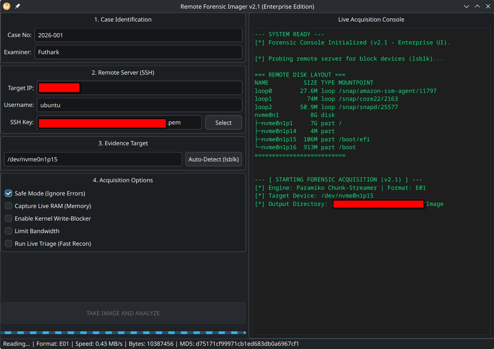
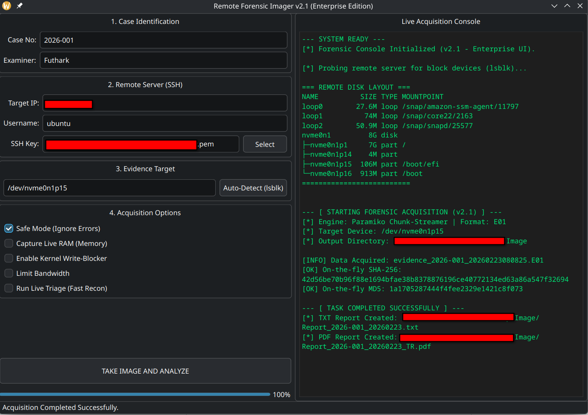

# 🕵️‍♂️ Remote Forensic Imager v2.0 (Enterprise Edition)

**Remote Forensic Imager** is a professional Python-based digital forensic tool designed for secure live disk and memory acquisition from remote servers (AWS EC2, VPS, etc.) over encrypted SSH channels.

Developed by **Futhark1393**, the tool automates the collection of bit-stream images while maintaining a strict **Chain of Custody (CoC)** and adhering to the **"Do No Harm"** forensic principle.



## 🚀 v2.0 Core Engine Updates (The Paramiko & E01 Upgrade)

The v2.0 release completely overhauls the acquisition engine, transitioning from OS-level `subprocess` pipes to a robust, API-based TCP socket architecture with native EnCase support:

* **Native E01 (EnCase) Support:** Direct integration with `libewf` allows for acquiring and compressing evidence directly into the industry-standard E01 format, complete with embedded case metadata (Case Number, Examiner).
* **API-Based SSH Streaming (Paramiko):** Eliminates `shell=True` subprocess dependencies and potential shell injection risks. Direct manipulation of the SSH TCP socket ensures absolute control over the data stream.
* **Chunk-Based Memory Management:** Data is streamed from the remote block device in 4MB chunks directly into the local RAM, preventing system I/O bottlenecks and GUI deadlocks.
* **On-The-Fly Hashing:** Dual-Hash (SHA-256 and MD5) signatures are calculated synchronously in-memory as each 4MB chunk arrives. This eliminates the need for post-process disk reading, proving the data's absolute integrity the millisecond the transfer concludes.
* **Asynchronous GUI (QThread):** The UI remains 100% responsive. Real-time metrics (MB/s, current bytes, live MD5) are passed via PyQt signals to the status bar without locking the main event loop.



---

## 🔥 Proof of Concept: Data Carving & Bit-Stream Accuracy

To verify that the tool performs a true physical (bit-stream) acquisition rather than just a logical file copy, a test was conducted on a 100MB AWS EC2 partition (`/dev/nvme0n1p15`). 

The resulting image was analyzed using **Autopsy**. During the analysis of the **Unallocated Space**, fragments of historical Linux documentation (a 1999 email from GNU FSF founder Richard Stallman regarding Readline libraries) were successfully carved and recovered. 

**Carved Header Data:**


**Carved Body Text:**


This artifact confirms that the Remote Forensic Imager successfully captures raw sector data, including data remanence and deleted files in unallocated space, proving its 100% lossless physical acquisition capability over an encrypted SSH stream.

---

## 🏗️ Modular Architecture

The tool is built with a highly decoupled structure:
* `main_qt6.py`: Application entry point.
* `codes/gui.py`: Manages the PyQt6 interface, PDF reporting engine, and dynamic extension handling for E01/RAW formats.
* `codes/engine.py`: The core headless `ForensicAcquisitionEngine` handling Paramiko connections, read-only kernel enforcement (`blockdev`), E01 compression via `pyewf`, and generator-based chunk streaming.
* `codes/threads.py`: `QThread` workers that bridge the headless engine with the GUI event loop.

---

## 🔗 Chain of Custody & Reporting

1. **Identification:** Logs exact IP, timestamps, and examiner details.
2. **Preservation:** Enforces Read-Only modes and secures images with Dual-Hash signatures.
3. **Documentation:** Automatically generates immutable `.txt` and professional `.pdf` Executive Summaries (EN/TR support).

> ⚖️ **NIST Compliance:** The acquisition methodology aligns with **NIST Special Publication 800-86** guidelines for verifiable data collection and cryptographic preservation.

---

## 🛠️ Environment & Installation

* **Supported OS:** Fedora Linux, Ubuntu, CAINE, and other major Linux distributions.
* **Language:** Python 3.10+
* **Dependencies:** `PyQt6`, `fpdf2`, `paramiko`, `libewf`

### ⚡ Automated Installation (Recommended)
The easiest way to install all dependencies, compile the `libewf` C-library for E01 support, and set up system-wide shortcuts is by using the provided automated script.

```bash
# 1. Clone the repository
git clone [https://github.com/Futhark1393/Remote-Forensic-Imager.git](https://github.com/Futhark1393/Remote-Forensic-Imager.git)
cd Remote-Forensic-Imager

# 2. Run the automated installer
chmod +x RFI_install.sh
./RFI_install.sh
```

### 🚀 Usage
Once installed via the automated script, you can launch the tool from anywhere:
* **Terminal:** Simply type `rfi` and hit Enter.
* **GUI:** Search for **"Remote Forensic Imager"** in your desktop application menu (KDE/GNOME launcher).

---

### ⚙️ Manual Installation (Advanced Users)
If you prefer to set up the environment manually without the installer script:

```bash
# 1. Install Python Dependencies
pip install PyQt6 fpdf2 paramiko

# 2. Install build tools (Fedora example)
sudo dnf install gcc gcc-c++ make python3-devel zlib-devel openssl-devel

# 3. Download and compile libewf for E01 Support (Experimental 20240506 or later)
wget [https://github.com/libyal/libewf/releases/download/20240506/libewf-experimental-20240506.tar.gz](https://github.com/libyal/libewf/releases/download/20240506/libewf-experimental-20240506.tar.gz)
tar -zxvf libewf-experimental-20240506.tar.gz
cd libewf-20240506/
./configure --prefix=/usr --enable-shared --enable-python
make
sudo make install

# 4. Ensure shared libraries are correctly placed and update linker cache
cd libewf/.libs/
sudo cp -a libewf.so* /usr/lib64/  # Use /usr/lib/ for Ubuntu/Debian
sudo ldconfig

# 5. Launch the tool
cd ../../
python3 main_qt6.py
```

---

## ⚠️ Disclaimer & Legal Warning
This tool is developed for educational purposes, incident response, and authorized digital forensic investigations. The author (**Futhark1393**) is not responsible for any misuse, data loss, or legal consequences resulting from the use of this software. Always ensure you have explicit, written permission from the system owner before performing any digital acquisition.

---
**Developed by Futhark1393**
