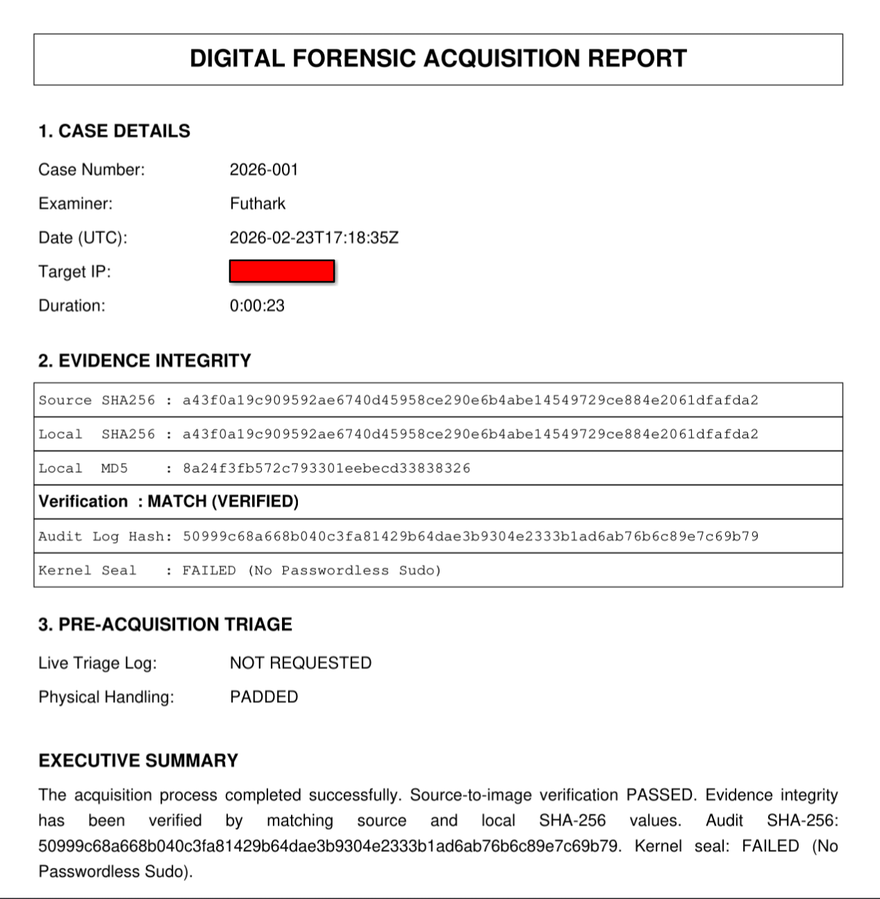
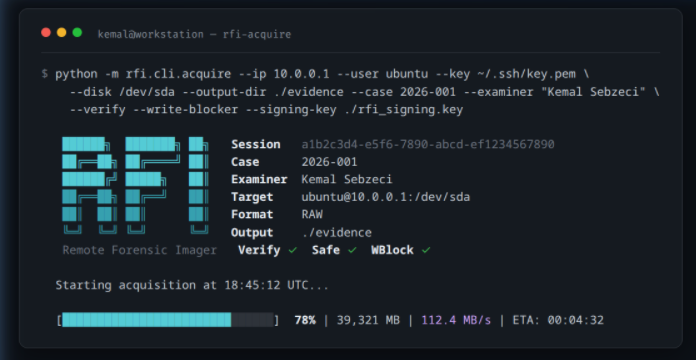

# Remote Forensic Imager (RFI)

**Author:** Futhark1393  
**Version:** 3.1.0  
**License:** MIT  

Remote Forensic Imager (RFI) is a **case-first remote disk acquisition framework** built with **Python + PyQt6**.

It enforces structured forensic workflows through an **explicit session state machine**, generates a **cryptographically hash-chained audit trail (JSONL)**, supports optional **source-to-stream SHA-256 verification**, and produces **TXT/PDF forensic reports** suitable for evidentiary documentation.

---

## Engineering Documentation

A detailed engineering write-up covering:

- Architecture decisions  
- Audit trail hash-chain model  
- Integrity verification approach  
- Threat considerations  

is available here:

👉 https://kemalsebzeci-site.vercel.app/blog/rfi-architecture

---

## Interface Preview

Screenshots included in `./screenshots/`

- Case Wizard  
  

- Main UI (Idle)  
  

- Remote Disk Discovery  
  

- Acquisition Running  
  

- Report Preview  
  

- CLI Mode  
  

---

# Core Capabilities

## Case-First Workflow

- Mandatory Case Wizard at startup
- Case Number + Examiner required
- Evidence directory binding required
- No acquisition allowed without active case context

## Session State Machine

RFI enforces forensic workflow ordering through an explicit state machine:

~~~text
NEW → CONTEXT_BOUND → ACQUIRING → VERIFYING → SEALED → DONE
~~~

- `bind_context()` — NEW → CONTEXT_BOUND (case wizard completion)
- `begin_acquisition()` — CONTEXT_BOUND → ACQUIRING (start imaging)
- `begin_verification()` — ACQUIRING → VERIFYING (post-acq hash check)
- `seal()` — ACQUIRING|VERIFYING → SEALED (lock audit trail)
- `finalize()` — SEALED → DONE

Illegal transitions (e.g., acquiring before context binding, logging after sealing) raise `SessionStateError` and halt operation. The GUI drives the session — it cannot bypass the workflow order.

## Tamper-Evident Audit Logging (JSONL)

- Structured per-session audit trail
- Cryptographic chaining (`prev_hash → entry_hash`)
- Deterministic JSON serialization
- Forced disk flush (`fsync`) per record
- Optional sealing (best-effort):
  - `chmod 444`
  - `chattr +i` (if available)
- **Optional Ed25519 digital signature** (detached `.sig` file)
- Offline chain verification + signature verification support
- **Optional SIEM/Syslog forwarding** (RFC 5424 over UDP/TCP, CEF output mode)

## Acquisition & Integrity

- SSH-based acquisition via pure-Python engine (headless-testable, no Qt dependency)
- Remote disk discovery (`lsblk`)
- On-the-fly dual hashing (MD5 + SHA-256) via `StreamHasher`
- Optional post-acquisition remote SHA-256 verification
- Safe Mode (`conv=noerror,sync`)
- Optional write-blocker enforcement (best-effort)
- Automatic retry on connection loss (up to 3 retries with resume)
- Configurable bandwidth throttling

## Reporting

- TXT forensic report
- PDF forensic report
- Includes:
  - Local hash values
  - Optional source hash
  - Verification result
  - Audit trail hash
  - Seal status

---

# CLI Tooling

## Headless Acquisition (No GUI)

Run forensic acquisition from any terminal — no X11 or Qt required:

~~~bash
rfi-acquire \
  --ip 10.0.0.1 --user ubuntu --key ~/.ssh/key.pem \
  --disk /dev/sda --output-dir ./evidence \
  --case 2026-001 --examiner "Investigator" \
  --format RAW --verify --safe-mode --write-blocker \
  --signing-key ./rfi_signing.key
~~~

All parameters:

| Parameter | Description |
|-----------|-------------|
| `--ip`, `--user`, `--key` | SSH connection details (required) |
| `--disk` | Target block device (required) |
| `--output-dir` | Evidence output directory (required) |
| `--case`, `--examiner` | Case metadata (required) |
| `--format RAW\|E01\|AFF4` | Evidence format (default: RAW) |
| `--verify` | Post-acquisition remote SHA-256 check |
| `--safe-mode` | `conv=noerror,sync` (default: on) |
| `--write-blocker` | Software write-blocker |
| `--throttle N` | Bandwidth limit in MB/s |
| `--signing-key PATH` | Ed25519 key for audit trail signing |

### Triage Parameters

| Parameter | Description |
|-----------|-------------|
| `--triage` | Enable live triage (network + processes) before acquisition |
| `--no-triage-network` | Skip network state collection |
| `--no-triage-processes` | Skip process list collection |
| `--triage-memory` | Collect memory metadata (`/proc/meminfo`, modules) |
| `--no-hash-exes` | Skip per-process SHA-256 executable hashing |

### SIEM / Syslog Parameters

| Parameter | Description |
|-----------|-------------|
| `--siem-host HOST` | Syslog/SIEM server hostname or IP |
| `--siem-port PORT` | Syslog port (default: 514) |
| `--siem-protocol UDP\|TCP` | Syslog protocol (default: UDP) |
| `--siem-cef` | Use CEF (Common Event Format) instead of RFC 5424 |

Example with triage + SIEM:

~~~bash
rfi-acquire \
  --ip 10.0.0.1 --user ubuntu --key ~/.ssh/key.pem \
  --disk /dev/sda --output-dir ./evidence \
  --case 2026-001 --examiner "Investigator" \
  --triage --triage-memory \
  --siem-host 10.0.0.100 --siem-port 514 --siem-protocol TCP --siem-cef
~~~

## Live Triage

When `--triage` is enabled, RFI collects volatile evidence from the target **before** acquisition begins. All collection is strictly **read-only** — nothing is written or loaded onto the target system.

### Network State

Collected via `ss`, `arp`, `ip route`, `ip neigh`, and `/etc/resolv.conf`:

- Active TCP/UDP connections
- ARP/neighbour table
- Routing table
- Network interface addresses
- DNS configuration

Output: `NetworkState_<CASE>_<UTC>.txt` + `NetworkState_<CASE>_<UTC>.json`

### Running Processes

Collected via `ps aux`. SHA-256 hash of each process executable is computed via `/proc/<pid>/exe` (read-only, no target modification):

Output: `ProcessList_<CASE>_<UTC>.txt` + `ProcessList_<CASE>_<UTC>.json`

### Memory State (`--triage-memory`)

Collected without modifying the target:

| Source | Description |
|--------|-------------|
| `/proc/meminfo` | Memory usage metadata (always available) |
| `/proc/modules` | Loaded kernel modules list |
| `/proc/kallsyms` | Symbol count (kernel integrity indicator) |
| `/proc/kcore` | Full physical memory image (requires root, read-only stream) |
| `/dev/lime*` | LiME device if already loaded by administrator |

> [!NOTE]
> RFI **never uploads kernel modules** to the target. Doing so would modify system state and breach chain of custody. LiME is only used if already present (loaded by a separate admin process before RFI connects).

Output: `MemoryState_<CASE>_<UTC>.json`

## Verify Audit Chain

~~~bash
rfi-verify AuditTrail_CASE_SESSION.jsonl
~~~

With digital signature verification:

~~~bash
rfi-verify AuditTrail_CASE_SESSION.jsonl --pubkey rfi_signing.pub
~~~

Machine-readable JSON output (for scripting / SIEM ingestion):

~~~bash
rfi-verify AuditTrail_CASE_SESSION.jsonl --json
~~~

Exit codes:

- `0` → PASS (chain + optional signature valid)
- `2` → FAIL (tampering detected)  
- `1` → Error  

## Generate Signing Keypair

~~~bash
python -c "from rfi.audit.signing import generate_signing_keypair; generate_signing_keypair('.')"
~~~

Creates `rfi_signing.key` (private, keep secure) and `rfi_signing.pub` (public, distribute for verification).

---

# Architecture

~~~text
rfi/
├── cli/                             # Headless CLI tools
│   ├── acquire.py                   # CLI acquisition (no Qt dependency)
│   └── verify.py                    # rfi-verify CLI (chain + sig verification)
├── triage/                          # Live triage collectors (read-only)
│   ├── orchestrator.py              # TriageOrchestrator (coordinates all collectors)
│   ├── network.py                   # Network state (ss, arp, ip route, DNS)
│   ├── processes.py                 # Process list + per-exe SHA-256 hashing
│   └── memory.py                    # Memory metadata (/proc/meminfo, kcore, LiME)
├── ui/                              # Qt / GUI layer
│   ├── gui.py                       # CaseWizard + ForensicApp (Session-driven)
│   ├── workers.py                   # Thin QThread wrapper (~70 lines, no business logic)
│   └── resources/
│       └── forensic_qt6.ui
├── core/                            # Business logic (Qt-free, headless-testable)
│   ├── session.py                   # Workflow state machine (NEW → DONE)
│   ├── hashing.py                   # StreamHasher (MD5 + SHA-256)
│   ├── policy.py                    # Write-blocker enforcement, dd command builder
│   └── acquisition/
│       ├── base.py                  # AcquisitionEngine (pure Python)
│       ├── raw.py                   # RawWriter
│       ├── ewf.py                   # EwfWriter
│       ├── aff4.py                  # AFF4Writer (requires pyaff4, optional)
│       └── verify.py                # Post-acquisition remote hash verification
├── audit/                           # Tamper-evident logging + signing
│   ├── logger.py                    # ForensicLogger (hash-chained JSONL + SIEM forwarding)
│   ├── verify.py                    # AuditChainVerifier
│   ├── signing.py                   # Ed25519 key generation, signing, verification
│   └── syslog_handler.py            # SyslogHandler (RFC 5424 + CEF, UDP/TCP)
├── report/
│   └── report_engine.py             # TXT + PDF forensic reporting
└── deps/
    └── dependency_checker.py        # Runtime dependency validation
~~~

### Design Principles

- **Layered separation** — UI knows nothing about SSH; core knows nothing about Qt
- **Headless-testable engine** — `AcquisitionEngine` uses callbacks, not Qt signals
- **State machine enforcement** — illegal workflow transitions are impossible
- **Fail-secure behavior** — audit failures halt acquisition
- **Tamper-evident logging** — deterministic hash chains with cryptographic sealing
- **Minimal implicit trust** — every component operates with least privilege
- **Read-only triage** — volatile evidence collected without modifying the target

### Testing

~~~bash
python -m pytest tests/ -v
~~~

Unit tests cover:
- Session state machine (valid/invalid transitions)
- StreamHasher (incremental hashing correctness)
- RawWriter (write/close behavior)
- Policy helpers (dd command construction)
- ForensicLogger (chain integrity, seal enforcement, tamper detection)
- Ed25519 signing (keygen → sign → verify round-trip, tamper detection)
- ReportEngine (TXT + PDF generation)

---

# Installation

## Quick Install (Recommended)

~~~bash
git clone https://github.com/Futhark1393/Remote-Forensic-Imager.git
cd Remote-Forensic-Imager
sudo bash RFI_install.sh
~~~

The installer:
- Detects your distro (Fedora/RHEL or Debian/Ubuntu/Kali) and installs system dependencies
- Downloads and compiles **libewf** (E01 format support)
- Creates a Python **virtual environment** (`.venv/`)
- Installs the RFI package inside the venv
- Symlinks `rfi`, `rfi-acquire`, `rfi-verify` → `/usr/local/bin` (available system-wide)
- Creates an application menu shortcut

### Install Options

| Flag | Effect |
|------|--------|
| *(none)* | Full install with E01 support |
| `--no-ewf` | Skip libewf compilation (faster, RAW only) |
| `--with-aff4` | Also install `pyaff4` for AFF4 format support |

~~~bash
# Fast install without E01
sudo bash RFI_install.sh --no-ewf

# Full install with AFF4 support
sudo bash RFI_install.sh --with-aff4
~~~

After install, open a **new terminal** (or run `hash -r`) and:

~~~bash
rfi              # Launch GUI
rfi-acquire --help   # Headless acquisition
rfi-verify --help    # Audit chain verification
~~~

---

## Manual Install

### 1) Clone

~~~bash
git clone https://github.com/Futhark1393/Remote-Forensic-Imager.git
cd Remote-Forensic-Imager
~~~

### 2) System Dependencies (Linux)

**Ubuntu / Debian / Kali**

~~~bash
sudo apt update
sudo apt install -y \
  libegl1 libgl1 libglib2.0-0 libxkbcommon0 libxkbcommon-x11-0 \
  libxcb1 libxcb-icccm4 libxcb-image0 libxcb-keysyms1 libxcb-randr0 \
  libxcb-render0 libxcb-render-util0 libxcb-shape0 libxcb-shm0 libxcb-sync1 \
  libxcb-xfixes0 libxcb-xinerama0 libxcb-xkb1 libxrender1 libxi6 \
  libsm6 libice6 libfontconfig1 libfreetype6
~~~

**Fedora**

~~~bash
sudo dnf install -y qt6-qtbase qt6-qtbase-gui mesa-libEGL mesa-libGL
~~~

### 3) Python Virtual Environment

~~~bash
python3 -m venv .venv
source .venv/bin/activate
pip install -U pip
pip install -e .
~~~

### 4) Optional: E01 (EWF) Support

~~~bash
sudo apt install -y libewf2 python3-libewf  # Debian/Ubuntu/Kali
# or
pip install libewf-python
~~~

### 5) Optional: AFF4 Support

~~~bash
pip install pyaff4
# or
pip install -e ".[aff4]"
~~~

# Running

## GUI Mode

~~~bash
python main_qt6.py
~~~

## CLI Mode (Headless)

~~~bash
./rfi-acquire --ip 10.0.0.1 --user ubuntu --key ~/.ssh/key.pem \
  --disk /dev/sda --output-dir ./evidence \
  --case 2026-001 --examiner "Investigator"
~~~

Or if installed via `pip install -e .`:

~~~bash
rfi-acquire --help
~~~

---

# Output Artifacts

Inside the selected Evidence Directory:

- `evidence_<CASE>_<UTC>.raw`, `.E01`, or `.aff4`
- `AuditTrail_<CASE>_<SESSION>.jsonl`
- `AuditTrail_<CASE>_<SESSION>.jsonl.sig` (if signing key provided)
- `Report_<CASE>_<UTC>.pdf`
- `Report_<CASE>_<UTC>.txt`
- `NetworkState_<CASE>_<UTC>.txt` + `.json` (if `--triage` enabled)
- `ProcessList_<CASE>_<UTC>.txt` + `.json` (if `--triage` enabled)
- `MemoryState_<CASE>_<UTC>.json` (if `--triage-memory` enabled)
- `MemoryDump_<CASE>_<UTC>.kcore` (if `/proc/kcore` accessible)

---

# Notes on Verification

- E01 is a container format.
- Integrity is calculated on the acquisition stream.
- If acquiring from a live system disk, post-acquisition `/dev/...` hashing may differ due to ongoing writes.
- For strict source-to-image equivalence:
  - Use snapshots
  - Use unmounted devices
  - Use hardware write-blockers

This is expected behavior and not a bug.

---

# License

MIT License — see [LICENSE](LICENSE)

---

# Author

Futhark1393
