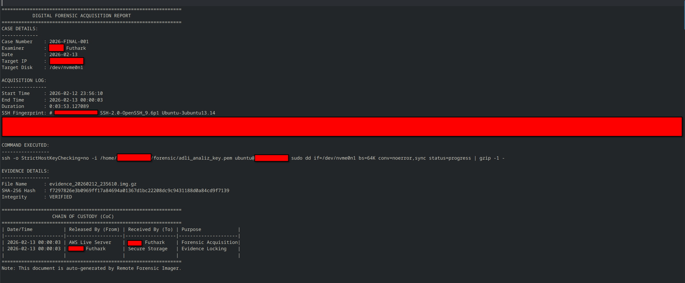

# 🕵️‍♂️ Remote Forensic Imager

**Remote Forensic Imager** is a Python-based digital forensic tool developed to perform live disk and volatile memory (RAM) acquisition from remote servers (AWS EC2, VPS, etc.) over encrypted channels.

Designed for incident responders and forensic examiners, the tool automates the process of collecting bit-stream images while maintaining a strict **Chain of Custody (CoC)**, ensuring data integrity, and adhering to the **"Do No Harm"** forensic principle through optional write-blocking.


## 🚀 Technical Capabilities

* **Live RAM (Memory) Acquisition (New):** Capable of extracting volatile memory directly from `/proc/kcore`. The system intelligently detects memory acquisition mode and bypasses physical write-blockers to prevent kernel errors on virtual file systems.
* **Software Write Blocker:** Capable of toggling the remote block device to **Read-Only (RO)** mode at the kernel level (`blockdev --setro`) during disk acquisition to prevent accidental data modification.
* **Live Bad Sector Logging:** Monitors `dd` output in real-time to detect and log **I/O errors (Bad Sectors)** directly into the final report without interrupting the acquisition process.
* **Secure Remote Acquisition:** Establishes encrypted SSH tunnels for secure data transfer.
* **Automated Chain of Custody:** Generates a forensic report (`.txt`) immediately after acquisition, documenting timestamps, source fingerprints, write-blocker status, acquisition type (RAM vs Disk), and disk health.
* **Integrity Verification:** Calculates SHA-256 hash values (Digital Seal) automatically post-acquisition.
* **Resilient Imaging:** Uses `dd` with `conv=noerror,sync` to ensure image consistency even in the presence of physical disk errors.

---

## 🧪 Laboratory Setup & Testing

You can simulate a forensic incident by setting up a controlled test environment.

### 1. Target Preparation (Remote Side)
Connect to your remote instance and place a "secret" evidence file:

````bash
# Connect to your test server
ssh -i your-key.pem ubuntu@remote-ip

# Inject evidence data
echo "CONFIDENTIAL_DATA_FOUND_BY_FUTHARK" > evidence_file.txt
````

### 2. Evidence Collection (Local Side)
1. Run the application: `python3 main_qt6.py`
2. Enter the **Case Number** and **Examiner Name**.
3. Input the Target IP and Disk Path (e.g., `/dev/nvme0n1`).
4. **(Optional)** Check **"Enable Software Write Blocker"** for kernel-level protection on physical disks.
5. **(Optional)** Check **"Capture Live RAM"** to override the target and extract volatile memory instead of the disk.
6. Click **"Take Image and Analyze"** to start the transfer.

### 3. Forensic Validation
After the transfer is complete, secure and verify your evidence in the terminal. *(Note: RAM dumps will be saved as `memory_evidence_*.kcore.gz`)*:

````bash
# 1. Lock the evidence (Local Write-Blocking)
chmod 444 evidence_*.img.gz

# 2. Verify Digital Seal (Hash Check)
sha256sum evidence_*.img.gz

# 3. Keyword Search (Content Analysis)
zgrep -a "CONFIDENTIAL_DATA" evidence_*.img.gz
````

---

## 🛡️ Automated Documentation & Crash-Proof Logging

The system generates an official **Forensic Acquisition Report** for every session. Additionally, it maintains a real-time `live_forensic.log` file to preserve operation logs even in case of a system crash.


*Figure: Auto-generated Forensic Report including Write Blocker Status, SSH Fingerprint, Acquisition Type, and CoC Table.*

---

## 🛠️ Environment & Installation

* **Development OS:** Fedora 43 Workstation (Gnome 49.3)
* **Language:** Python 3.10+
* **Dependencies:** `pip install PyQt6`

````bash
# Clone and Run
git clone https://github.com/Futhark1393/Remote-Forensic-Imager.git
cd Remote-Forensic-Imager
python3 main_qt6.py
````

## ⚠️ Disclaimer

This tool includes features that interact with the remote kernel (`blockdev` and `/proc/kcore`). While it implements safety mechanisms to restore system state and bypass unsafe operations, it is intended for **authorized forensic investigations** only. The developer (**Futhark**) assumes no liability for unauthorized access or misuse.

---

**Developed by Futhark**
