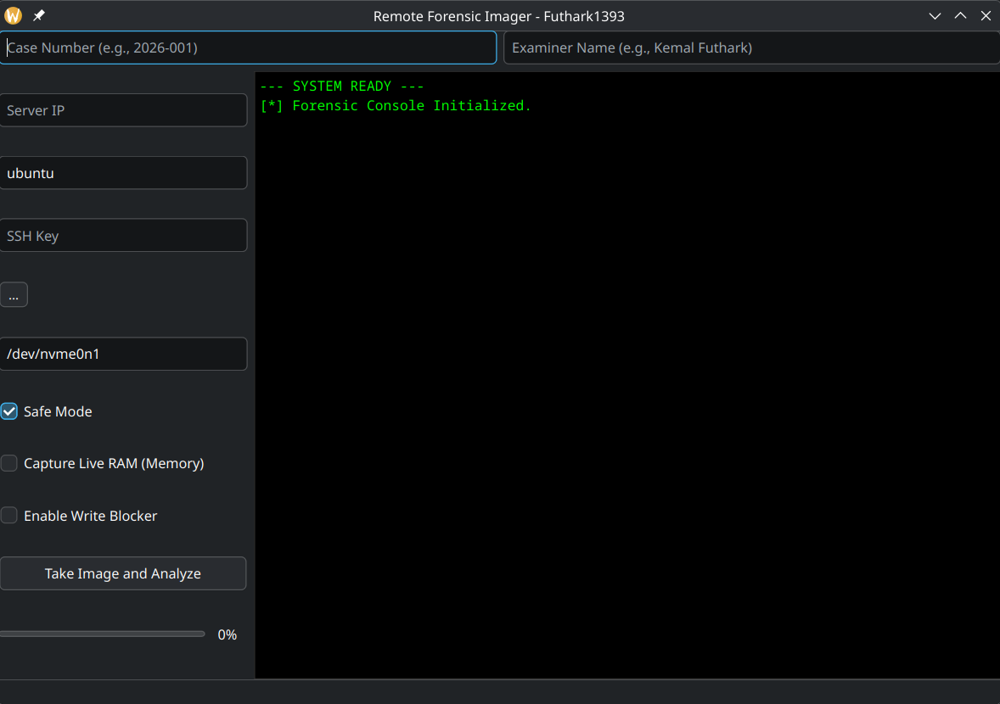

# 🕵️‍♂️ Remote Forensic Imager

**Remote Forensic Imager** is a professional Python-based digital forensic tool designed for secure live disk and memory acquisition from remote servers (AWS EC2, VPS, etc.) over encrypted SSH channels.

[cite_start]Developed by **Futhark1393**, the tool automates the collection of bit-stream images while maintaining a strict **Chain of Custody (CoC)** and adhering to the **"Do No Harm"** forensic principle[cite: 1, 2, 4].



## 🚀 Technical Capabilities

* [cite_start]**Auto-Discovery:** Probes the remote server via single-shot SSH (`lsblk`) to display the physical disk layout directly in the console.
* [cite_start]**Live Triage:** Executes rapid volatile data collection (network connections, processes, logs) before disk acquisition.
* [cite_start]**Bandwidth Throttling:** Integrates with `pv` (Pipe Viewer) to limit transfer speeds and prevent network bottlenecks.
* [cite_start]**Dual-Hash Verification:** Automatically calculates both **SHA-256** and **MD5** digital signatures for evidence integrity[cite: 4].
* [cite_start]**Software Write Blocker:** Sets the target block device to **Read-Only (RO)** mode at the kernel level (`blockdev --setro`).
* [cite_start]**Multi-Format Reporting:** Generates technical `.txt` logs and professional `.pdf` Executive Summaries in multiple languages (EN/TR)[cite: 4].

---

## 🏗️ Modular Architecture

[cite_start]The tool is built with a highly modular structure:
* `main_qt6.py`: Application entry point.
* [cite_start]`codes/gui.py`: Manages the PyQt6 interface and PDF reporting engine[cite: 4].
* [cite_start]`codes/acquisition.py`: Handles SSH tunneling, `dd` streaming, and Triage.
* [cite_start]`codes/analysis.py`: Performs SHA-256/MD5 hashing and binary header analysis[cite: 4].

---

## 🧪 Laboratory Setup & Testing

### 1. Target Preparation (Remote Side)
Connect to your remote instance and place a "secret" evidence file:
```bash
ssh -i your-key.pem ubuntu@remote-ip
echo "CONFIDENTIAL_DATA_FUTHARK1393" > evidence.txt
```

### 2. Evidence Collection (Local Side)
1. [cite_start]Run the application: `python3 main_qt6.py`.
2. [cite_start]Click **"Auto-Detect"** to identify the remote disks.
3. Enter the target disk (e.g., `/dev/nvme0n1p1`).
4. [cite_start]Click **"Take Image and Analyze"** to start the process.
5. [cite_start]Select the report language (EN/TR) from the popup menu[cite: 4].

---

## 🔗 Chain of Custody (CoC) Protocol

In digital forensics, the **Chain of Custody** is the documentation recording the sequence of custody and transfer of evidence. This tool enforces CoC through:
1.  [cite_start]**Identification:** Logs exact IP, SSH fingerprints, and timestamps.
2.  [cite_start]**Preservation:** Enforces Read-Only modes and secures images with Dual-Hash signatures[cite: 1, 4].
3.  [cite_start]**Documentation:** Automatically generates a CoC report mapping the transfer from the target to the examiner.

> [cite_start]**⚖️ NIST Compliance:** The acquisition methodology aligns with **NIST Special Publication 800-86** guidelines for verifiable data collection and cryptographic preservation[cite: 4].

---

## 🛠️ Installation & Requirements

* [cite_start]**OS:** Fedora 43 (KDE Plasma) [cite: 3]
* **Language:** Python 3.10+
* [cite_start]**Dependencies:** `PyQt6`, `fpdf2`, `pv` [cite: 1, 4]

```bash
# Install dependencies
sudo dnf install pv
pip install PyQt6 fpdf2

# Run
python3 main_qt6.py
```

## ⚠️ Important Note
When acquiring RAM via `/proc/kcore`, the virtual file size may appear extremely large (TB range). It is recommended to use `dd` with specific block counts or target physical memory offsets to avoid excessive data transfer[cite: 4].

---
**Developed by Futhark1393** [cite: 2]
